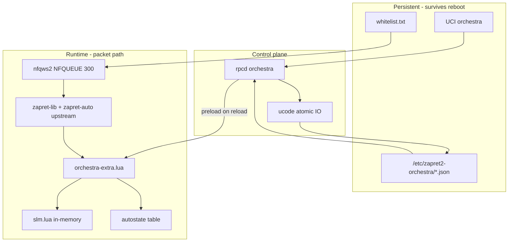

# Port map: Desktop Orchestra → OpenWrt/Zapret2

**Audit date:** 2026-07-17 (updated post-import)  
**Scope:** `router-baseline/`, `reference/desktop-orchestra/`, `docs/`.  
**Legend:** CONFIRMED = router baseline; COMPATIBLE / REQUIRES ADAPTER = see `router-desktop-compatibility.md`; EXTERNAL-REF = superseded by `reference/` where imported; UNKNOWN / NOT CAPTURED = see `current-state.md`.

---

## 1. Repository map (CONFIRMED)

| Path | Role | Status |
|------|------|--------|
| `AGENTS.md` | Project rules: preserve upstream, no patch `zapret-auto.lua`, TLS-first, backup/rollback | CONFIRMED |
| `.agents/skills/zapret2-port/SKILL.md` | Port workflow, read `docs/current-state.md`, one protocol at a time | CONFIRMED |
| `.agents/skills/router-safe-deploy/SKILL.md` | Live-router deploy checklist (not used in this audit) | CONFIRMED |
| `docs/` | Architecture audit artifacts (this audit) | CONFIRMED (created) |
| `router-baseline/` | OpenWrt/Zapret2 snapshot (partial) | **CONFIRMED** — see `import-completeness.md` |
| `reference/desktop-orchestra/` | Desktop Orchestra Lua + settings | **CONFIRMED** |
| `lua/orchestra-extra/` | TLS runtime extension | **INSTALLED** — package installs to `/opt/zapret2/lua/orchestra-extra/`; preload generator + boot hook added in Phase 0 |
| OpenWrt-native control plane | Not implemented | Must verify ucode/rpcd contract before coding; no Python dependency on router |

### ~~External reference (superseded)~~

Use `reference/desktop-orchestra/` instead of `D:\Dev\`. Old EXTERNAL-REF paths retained only in git history.

**Still missing from baseline:** `linux_daemons.sh`, `firewall.zapret2`, `nfqws2-process.txt` — see `import-completeness.md`.

---

## 2. Feature correspondence table

| Orchestra concept | Desktop source (EXTERNAL-REF) | OpenWrt target component | Dependencies | Risks | Status |
|-------------------|------------------------------|--------------------------|--------------|-------|--------|
| **Whitelist** | `whitelist.txt` + `--hostlist-exclude=` in `circular-config.txt`; `settings.json` → `orchestra.whitelist.user_domains` | UCI `orchestra.whitelist` + hostlist file; nfqws2 `--hostlist-exclude` | Zapret2 hostlist mode, LuCI list editor | Whitelist must exclude host **before** Lua orchestrator runs; partial bypass if only Lua-side | EXTERNAL-REF / INFERRED |
| **Blocked strategies (default)** | `learned-strategies.lua` → `slm_preload_blocked(askey, host, {…})`; auto-learned failures (Python-generated, comment in SLM) | JSON `blocked.default[askey][host][]` + UCI mirror; preload at Lua init | `strategy-lock-manager.lua` → `BLOCKED_STRATEGIES`, `slm_is_blocked` | Desktop merges default+user in one table at runtime; OpenWrt must keep layers separate per requirements | EXTERNAL-REF / INFERRED |
| **Blocked strategies (user)** | `settings.json` → `orchestra.user_blocked` | JSON `blocked.user[askey][host][]` + UCI; merged at preload only | Backend merge policy | User block must override re-learn of same strategy | INFERRED |
| **Manual lock** | `slm_set_locked`, `slm_preload_locked(..., is_user_lock=true)`; `settings.json` → `orchestra.user_locked` | JSON + UCI; `orchestra-extra.lua` preload; `is_user_lock=true` | SLM quality record | **Gap:** `slm_set_locked` does not set `is_user_lock` (EXTERNAL-REF) — OpenWrt must fix | EXTERNAL-REF / INFERRED |
| **Auto lock** | `slm_should_lock`, `circular_quality` success path | Same SLM logic in `orchestra-extra.lua`; persist to learned state | `lock_successes`, `lock_tests`, `lock_rate` args | Premature lock if detector false-positive | EXTERNAL-REF |
| **Auto unlock** | `circular_quality` + `unlock_fails` + `slm_reset`; skips unlock if `slm_is_user_lock` | Same; backend clears learned lock, keeps manual | Failure detector on locked strat | Flapping on unstable links | EXTERNAL-REF |
| **Ratings / history** | `SLM_QUALITY[askey][host].strategy_*`; `settings.json` → `orchestra.history` | JSON `ratings` + `history`; preload via `slm_preload_history` | Per-packet `slm_record_result` | Writing from packet path forbidden (AGENTS.md) — async persist only | EXTERNAL-REF / INFERRED |
| **Circular fallback** | `zapret-auto.lua` → `circular`; Orchestra uses `circular_quality` with blocked skip loop | nfqws2 `--lua-desync=circular_quality:key=tls:…` or wrapper in `orchestra-extra.lua` | `desync.plan`, `strategy=N` instances | Strategy numbering gaps cause hard error | EXTERNAL-REF |
| **Decision priority** | Implicit in `circular_quality` order (not identical to requested list) | Explicit pipeline in `orchestra-extra.lua` | See `tls-mvp-design.md` | Desktop whitelist is hostlist-level, not inside `circular_quality` | INFERRED |
| **Protocol keys (askey)** | `circular-config.txt`: `key=tls|http|quic|…` | Same keys in state schema | Profile split TCP/UDP | MVP TLS-only | EXTERNAL-REF |
| **Backend / UI** | Python Orchestra app (not in repo; only `settings.json` + logs) | ucode/rpcd backend + LuCI later | OpenWrt 25.12.5 | Native control-plane contract must be verified first | NOT IMPLEMENTED |
| **Persistence** | `settings.json`, generated `learned-strategies.lua` | Versioned JSON seeds under `/etc/zapret2-orchestra/`; runtime `/tmp/zapret2-orchestra/` | Atomic write and last-good still required in native backend | No persistent write in nfq path | SCHEMA/SEEDS ONLY |
| **Dry-run / rollback** | Desktop restart + config regen | Deploy skill: backup, validate, health, rollback | `router-safe-deploy` skill | No baseline to test against | INFERRED |

---

## 3. Desktop module → OpenWrt component mapping

### Upstream Zapret2 (must stay unmodified)

| File | Symbols | OpenWrt role |
|------|---------|--------------|
| `zapret-lib.lua` | `orchestrate`, `execution_plan`, `plan_instance_pop/execute` | Bundled with Zapret2 package unchanged |
| `zapret-antidpi.lua` | desync primitives | Unchanged |
| `zapret-auto.lua` | `circular`, `standard_*_detector`, `automate_host_record` | Unchanged; Orchestra hooks via wrapper |

### Orchestra extensions (reference → new files)

| Desktop (EXTERNAL-REF) | Proposed OpenWrt path | Notes |
|------------------------|----------------------|-------|
| `combined-detector.lua` | `lua/orchestra-extra/detectors.lua` + orchestrator | Split for maintainability |
| `strategy-lock-manager.lua` | `lua/orchestra-extra/slm.lua` | Core state machine |
| `strategy-stats.lua` | `lua/orchestra-extra/preload.lua` | Init-time preload only |
| `learned-strategies.lua` | `/etc/zapret2-orchestra/*.json` → generated `/tmp/zapret2-orchestra/preload.lua` | Backend owns JSON; Lua loads once; generator implemented in ucode (Phase 0) |
| `whitelist.txt` | `/tmp/zapret2-orchestra/whitelist.txt` | Generated from persistent JSON by ucode generator at boot and install time |
| `circular-config.txt` (TLS section) | UCI `zapret2` / custom include | TLS MVP profile |

### Backend / LuCI

| Component | Path (INFERRED) | Responsibility |
|-----------|-----------------|----------------|
| CLI | not implemented | Add only after the native backend contract is fixed |
| rpcd/ucode | not implemented | Target OpenWrt-native control plane; verify installed APIs first |
| LuCI app | not implemented | JS UI after TLS runtime and backend validation |
| Init hook | **Not** `/etc/init.d/zapret2` replacement | Include fragment or `lua-init` drop-in only |

---

## 4. Integration dependency graph

---

## 5. Risks summary

| Risk | Severity | Mitigation |
|------|----------|------------|
| Partial baseline (no daemons/firewall scripts) | **Blocker for deploy** | Copy `linux_daemons.sh`, `firewall.zapret2`, running-process snapshot |
| Router on remittor **static** profile, not Orchestra | **Design** | UCI overlay switches TLS block to `circular_quality` when Orchestra enabled |
| `zapret-lib` v5 router vs v6 desktop reference | **Risk** | Never replace router lib; port orchestra-extra against v5 |
| Runtime contract unverified on target nfqws2 build | **Blocker** | Diff desktop vs router `zapret-auto.lua`; run Lua smoke on router |
| Persistent write from packet path | High | Persistent JSON is backend-only; Lua writes bounded transition events under `/tmp/zapret2-orchestra/` |
| `slm_set_locked` missing `is_user_lock` | Medium | OpenWrt `orchestra-extra` sets flag on manual lock |
| Whitelist only at hostlist vs Lua layer | Medium | Document two-layer whitelist; hostlist is authoritative for bypass |
| No default vs user blocked separation in desktop SLM | Medium | Explicit merge order in OpenWrt schema |
| Python-generated `learned-strategies.lua` on desktop | Medium | Replace with JSON + ucode generator on OpenWrt |

---

## 6. Audit conclusion

| Item | Verdict |
|------|---------|
| Repo ready for implementation | **CONDITIONAL GO** — orchestra-extra + tests; not deploy |
| Upstream orchestrator API on router | **CONFIRMED** — `circular`, `orchestrate` identical |
| Orchestra on router today | **UNAVAILABLE** — modules not installed; active UCI is static desync |
| Hook point | **SAFE WITH ADAPTER** — extra `--lua-init` + UCI profile overlay |

See also: `remittor-runtime-contract.md`, `orchestra-state-schema.md`, `tls-mvp-design.md`, `checkpoints/latest.md`.
