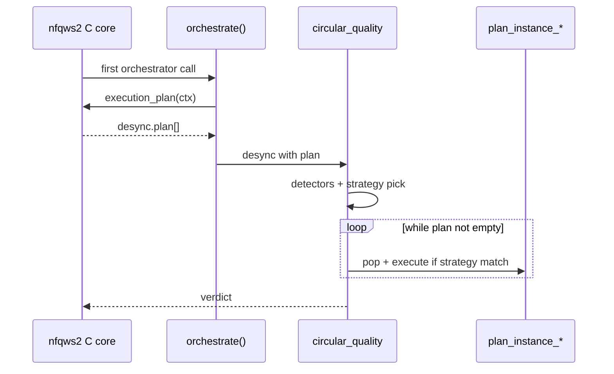

# Remittor / Zapret2 / nfqws2 Lua runtime contract

**Audit date:** 2026-07-17 (updated post-import)  
**Target:** OpenWrt 25.12.5, nfqws2 0.9.20260307, `lua_compat_ver 5` — **CONFIRMED** from baseline.  
**Evidence:** `router-baseline/` (CONFIRMED), `reference/desktop-orchestra/` (desktop reference).  
**NOT CAPTURED:** NFQUEUE number, live nfqws2 argv, default `--lua-init` chain — need `linux_daemons.sh`, `nfqws2-process.txt`.

---

## 1. Lua load order

### CONFIRMED (router)

- Upstream files live at `/opt/zapret2/lua/` (`zapret2-file-inventory.txt` L140–145).
- `zapret-antidpi.lua` header documents standard init: `--lua-init=@zapret-lib.lua --lua-init=@zapret-antidpi.lua` (L5).
- Router UCI `NFQWS2_OPT` (`etc/config/zapret2` L38–58) contains **only** `--lua-desync=…` — no Orchestra, no `circular_quality`.

### CONFIRMED (desktop reference)

`reference/desktop-orchestra/lua/circular-config.txt` L12–20:

```
--lua-init=@lua/zapret-lib.lua
--lua-init=@lua/zapret-antidpi.lua
--lua-init=@lua/zapret-auto.lua
--lua-init=@lua/strategy-lock-manager.lua
--lua-init=@lua/strategy-stats.lua
--lua-init=@lua/combined-detector.lua
```

### NOT CAPTURED (router default chain)

Exact argv built by `/opt/zapret2/common/linux_daemons.sh` — **on router** (inventory L30) but **not imported**. Do not assume `zapret-auto.lua` is loaded until script captured.

### Orchestra extension order (INFERRED)

After upstream lib + antidpi + auto → `orchestra-extra/init.lua` (loads SLM, detectors, preload from JSON).

---

## 2. Orchestrator entry points

### 2.1 `circular` — upstream (**IDENTICAL** on router and reference)

**Router file:** `router-baseline/opt/zapret2/lua/zapret-auto.lua`  
**Reference file:** `reference/desktop-orchestra/lua/zapret-auto.lua` (549 lines, same layout)  
**Symbol:** `function circular(ctx, desync)` (L312)

| Step | Behavior | Status |
|------|----------|--------|
| 1 | `orchestrate(ctx, desync)` | **CONFIRMED** router L341 / reference |
| 2 | Require `desync.track` | **CONFIRMED** |
| 3 | `automate_host_record(desync)` | **CONFIRMED** router `zapret-auto.lua` L29 |
| 4 | Count `strategy=N`; validate contiguous | **CONFIRMED** |
| 5 | `automate_failure_check` → rotate | **CONFIRMED** |
| 6 | `plan_instance_pop/execute` | **CONFIRMED** router `zapret-lib.lua` L218–235 |

**Args (documented in source):** `fails`, `time`, `success_detector`, `failure_detector`, `hostkey`, `key` (askey).

### 2.2 `circular_quality` — Orchestra (**UNAVAILABLE on router**)

**Reference only:** `reference/desktop-orchestra/lua/combined-detector.lua` L942  
**Router:** not in Lua inventory — must ship via `orchestra-extra/`.

Replaces desktop `circular` in `circular-config.txt`:

```
--lua-desync=circular_quality:key=tls:fails=1:failure_detector=combined_failure_detector:success_detector=combined_success_detector:lock_successes=3:unlock_fails=3:lock_tests=5:lock_rate=0.6:inseq=0x1000:nld=3
```

| Step | Behavior | Status |
|------|----------|--------|
| Skip replay packets (`desync.replay_seq`) | EXTERNAL-REF |
| `orchestrate(ctx, desync)` first | EXTERNAL-REF |
| Hostkey: `standard_hostkey` or custom; NLD via `nld=3`; special full-hostname list via `slm_should_keep_full_hostname` | EXTERNAL-REF |
| Run failure/success detectors every packet (even when locked) | EXTERNAL-REF |
| Locked path: `slm_get_locked`; auto-unlock after `unlock_fails`; user lock protected | EXTERNAL-REF |
| Unlocked path: record quality, rotate skipping blocked, `slm_should_lock` on success | EXTERNAL-REF |
| Execute current `hrec.nstrategy` instance only | EXTERNAL-REF |

**Note:** Requested decision priority (Whitelist → Blocked → Manual → Auto → Rating → Circular) is **not** implemented as a single function on desktop; whitelist is enforced via **hostlist-exclude** before Lua runs.

---

## 3. Execution plan lifecycle (EXTERNAL-REF)

**File:** `zapret-lib.lua`

| Symbol | Contract |
|--------|----------|
| `orchestrate(ctx, desync)` | If `desync.plan` nil: `execution_plan_cancel(ctx)` then `desync.plan = execution_plan(ctx)` |
| `plan_instance_pop(desync)` | FIFO remove from `desync.plan` |
| `plan_instance_execute(desync, verdict, instance)` | Apply instance args; call `_G[instance.func](nil, desync)`; aggregate verdict |
| Nested orchestrators | Preserved via lazy plan creation |

**Lifecycle per packet (INFERRED):**



**Replay:** When `desync.replay_seq` set, plan already consumed — orchestrator returns PASS (EXTERNAL-REF).

---

## 4. Host / connection records

### 4.1 Host record (EXTERNAL-REF, `zapret-auto.lua`)

```lua
-- Key: autostate[askey][hostkey]
-- askey = desync.arg.key or desync.func_instance
-- hostkey = standard_hostkey(desync)  -- NLD, IP fallback
```

| Field (circular) | Purpose |
|------------------|---------|
| `nstrategy` | Current strategy index |
| `ctstrategy` | Total strategies in plan |
| `final` | Stop rotation at strategy N |
| `failure_counter`, `failure_time_last` | Rotation threshold |

| Field (circular_quality) | Purpose |
|--------------------------|---------|
| `locked_fail_count` | Auto-unlock counter |
| (via SLM) `SLM_QUALITY[askey][hostkey]` | Ratings, lock state |

**Persistence:** `autostate` is **in-memory per process** — lost on nfqws2 restart (EXTERNAL-REF). Learned locks/ratings reloaded from preload file.

### 4.2 Connection record

```lua
desync.track.lua_state.automate  -- per-connection flags
```

Flags include: `failure`, `nocheck`, `quality_success_recorded`, `quality_failure_recorded`, `locked_failure_recorded` (EXTERNAL-REF).

### 4.3 Track object (partial, EXTERNAL-REF)

| Field | Use |
|-------|-----|
| `desync.track.hostname` | SNI / HTTP host |
| `desync.track.hostname_is_ip` | Skip NLD |
| `desync.track.lua_state` | Conn-scoped Lua state |
| `desync.l7payload` | e.g. `http_reply`, TLS types |
| `desync.outgoing` | Direction for detectors |
| `desync.dis` | Dissected packet |
| `desync.arg` | Instance arguments from profile |
| `desync.func_instance` | Current desync function name |

**UNKNOWN:** Full `desync` schema on OpenWrt build; assume API-compatible with 0.9.20260307.

---

## 5. Success / failure detection (TLS MVP)

### Standard detectors (EXTERNAL-REF, `zapret-auto.lua`)

| Detector | TLS-relevant signals |
|----------|---------------------|
| `standard_failure_detector` | TCP retrans, inbound RST, HTTP redirect to block page, TLS alert |
| `standard_success_detector` | Valid TLS server response, HTTP success |

### Orchestra combined detectors (EXTERNAL-REF, `combined-detector.lua`)

| Detector | Role |
|----------|------|
| `combined_failure_detector` | Wraps standard + TLS alert heuristics |
| `combined_success_detector` | Wraps standard success |

**TLS MVP profile args (EXTERNAL-REF):** `fails=1`, `lock_successes=3`, `unlock_fails=3`, `lock_tests=5`, `lock_rate=0.6`, `nld=3`.

**Failure priority:** In `circular_quality`, failure overrides success in same connection (EXTERNAL-REF, ~L1137).

---

## 6. Strategy application

| Rule | Source |
|------|--------|
| Each desync instance after orchestrator carries `strategy=N` | Profile config |
| Numbers must be 1..N contiguous | `circular` / `circular_quality` |
| Only instance matching `hrec.nstrategy` executes | EXTERNAL-REF |
| Blocked strategies skipped during rotation | `slm_is_blocked` loop |
| Strategy 1 = pass (VERDICT_PASS) | INFERRED from SKIP_PASS logic |

---

## 7. Orchestra SLM API (EXTERNAL-REF, extension layer)

**File:** `strategy-lock-manager.lua`

| Function | Purpose |
|----------|---------|
| `slm_normalize_hostkey(hostname)` | Lowercase, trim dots |
| `slm_is_blocked(askey, host, strategy)` | Check `BLOCKED_STRATEGIES[askey][host]` |
| `slm_get_locked(askey, host)` | Current auto/manual lock |
| `slm_is_user_lock(askey, host)` | Protect from auto-unlock |
| `slm_set_locked(askey, host, strat, reason)` | Manual lock (**does not set `is_user_lock`** — gap) |
| `slm_record_result(askey, host, strat, success)` | Rating counters |
| `slm_get_best(askey, host, skip_strat)` | Best by successes / rate |
| `slm_should_lock(askey, host, desync.arg)` | Auto-lock threshold |
| `slm_reset(askey, host)` | Clear quality + lock |
| `slm_preload_locked/blocked/history(...)` | Init-time load |

**Global tables:** `SLM_QUALITY`, `BLOCKED_STRATEGIES` (runtime, init preload).

---

## 8. Extension attachment points (INFERRED for OpenWrt)

| Hook | Mechanism | Constraint |
|------|-----------|------------|
| Load Orchestra logic | `--lua-init=orchestra-extra.lua` | No upstream edits |
| Orchestrator selection | Profile `--lua-desync=circular_quality:key=tls:…` | Must exist in C registry |
| Preload state | `orchestra-extra` reads JSON → calls `slm_preload_*` at init | No I/O in packet handler |
| Persist learned state | rpcd/ucode writes JSON; SIGHUP/restart nfqws2 to reload | AGENTS.md: no persistent write in packet path |
| Whitelist | `--hostlist-exclude=/tmp/zapret2-orchestra/whitelist.txt` | Hostlist mode and option CONFIRMED; file is generated locally |

**Must NOT do (CONFIRMED):**
- Patch `zapret-auto.lua`, `zapret-lib.lua`, `zapret-antidpi.lua`
- Replace `/etc/init.d/zapret2`

---

## 9. Confirmed vs unknown checklist

| Topic | Verdict |
|-------|---------|
| `circular` on router | **CONFIRMED** — `router-baseline/.../zapret-auto.lua` L312 |
| `orchestrate` on router | **CONFIRMED** — `zapret-lib.lua` L230 |
| `NFQWS2_COMPAT_VER=5` on router | **CONFIRMED** — `zapret-lib.lua` L1; matches `nfqws2-version.txt` |
| Desktop reference lib is v6 | **CONFIRMED** — do not deploy to router |
| OpenWrt active profile | **CONFIRMED static** — UCI `NFQWS2_OPT` fake/multisplit, not Orchestra |
| `circular_quality` on router | **UNAVAILABLE** |
| NFQUEUE 300 + bypass | **NOT CAPTURED** |
| Default `--lua-init` on router | **NOT CAPTURED** |
| POSTNAT, hostlist, IPv6 off | **CONFIRMED** — UCI |
| Orchestra modules on router | **UNAVAILABLE** |
| Safe extra `--lua-init` | **SAFE WITH ADAPTER** — see `router-desktop-compatibility.md` §5 |

---

## 10. Contradictions / gaps

1. **Manual lock vs auto-unlock:** **CONFIRMED** — `slm_set_locked` (`reference/.../strategy-lock-manager.lua` L646–671) does not set `is_user_lock`; fix in `orchestra-extra/slm-adapter.lua` only.
2. **Default vs user blocked:** Desktop single `BLOCKED_STRATEGIES`; OpenWrt schema merges at preload — unchanged.
3. **Router vs desktop upstream lib:** **CONFIRMED** compat v5 vs v6 — not interchangeable.
4. **Active router is not running Orchestra:** **CONFIRMED** — UCI profile contradicts assumption that Orchestra is live on router.
