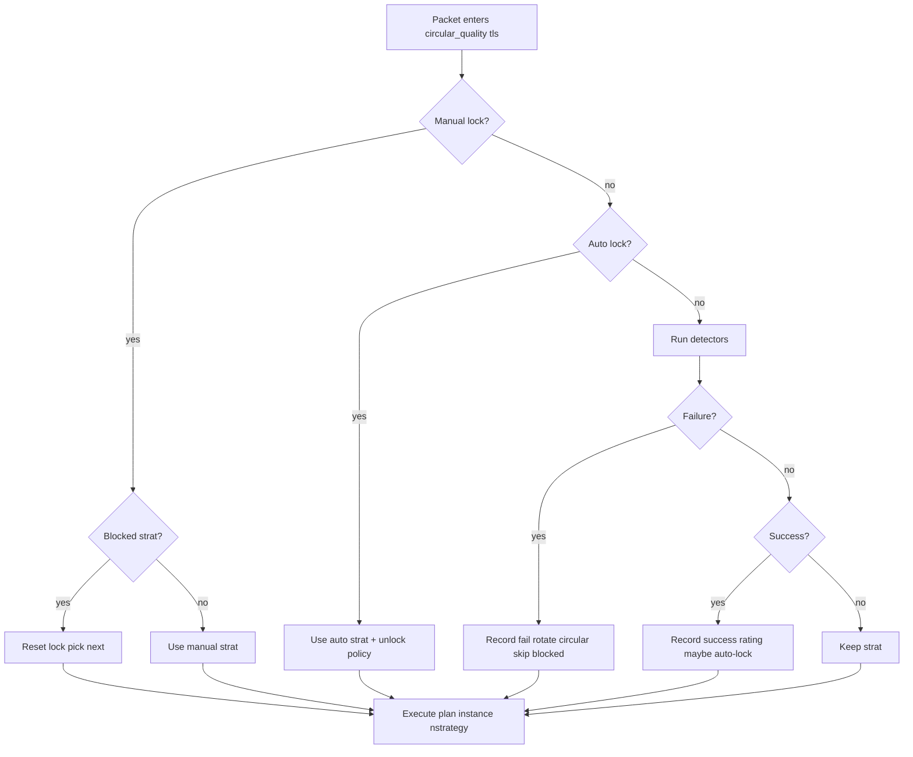
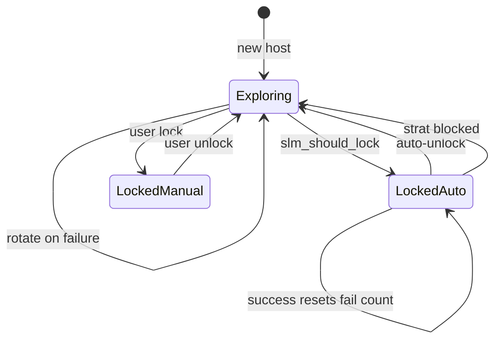

# TLS-only MVP design

**Audit date:** 2026-07-17 (updated post-import)  
**Baseline:** remittor Zapret2 on OpenWrt 25.12.5; nfqws2 0.9.20260307; **static** TLS profile today.  
**Verdict:** **CONDITIONAL GO** — implement orchestra-extra locally; staging blocked until runtime snapshots complete.

---

## 1. MVP boundaries

| In scope | Out of scope |
|----------|--------------|
| `askey=tls` profiles on TCP 443 (and 80 if TLS-like detection path shared) | `quic`, `discord`, `wireguard`, `dns`, `stun`, `unknown` |
| Hostname from SNI / `desync.track.hostname` | IP-only hosts unless `reqhost` waived |
| `circular_quality` + combined detectors | Custom per-site desync authoring |
| Whitelist via hostlist-exclude + config | Full LuCI polish |
| JSON learned state + manual UCI whitelist | Multi-router sync |
| Dry-run validation + rollback hooks | Live router deploy (this phase) |

**User environment:** POSTNAT=1, hostlist, IPv4-only — **CONFIRMED** UCI. NFQUEUE 300 — **NOT CAPTURED**.

---

## 2. Input events

| Event | Source | Status |
|-------|--------|--------|
| Outgoing TCP SYN / ClientHello | nfqws2 → Lua `desync` | EXTERNAL-REF |
| Incoming server packets | Same flow via conntrack | EXTERNAL-REF |
| Replay invocations | `desync.replay_seq` set | EXTERNAL-REF |

**Host identification (TLS MVP):**

1. `desync.track.hostname` from SNI (preferred).
2. Apply `standard_hostkey(desync)` with `nld=3` unless host in separate-subdomain list.
3. Normalize via `slm_normalize_hostkey`.
4. `askey = desync.arg.key` → `"tls"` from profile.

**Skip conditions:**

| Condition | Action |
|-----------|--------|
| Host on whitelist (hostlist-exclude) | Packet never enters orchestrator — **no Lua** |
| No hostname and `reqhost` default | No host record — pass |
| `desync.replay_seq` | Return PASS immediately |

---

## 3. Decision pipeline (explicit priority)

Implement in `orchestra-extra.lua` as wrapper or fork of `circular_quality` logic.

```
1. WHITELIST     → already filtered by hostlist (pre-Lua). In-Lua double-check optional.
2. BLOCKED       → slm_is_blocked(askey, host, strategy) during selection
3. MANUAL LOCK   → locks.manual / slm_is_user_lock + slm_get_locked
4. AUTO LOCK     → locks.auto / slm_get_locked (not user)
5. RATING        → slm_get_best when choosing among candidates
6. CIRCULAR      → increment nstrategy skipping blocked; fallback order 1..N
```



**Difference from desktop (EXTERNAL-REF):** desktop interleaves lock/rating/rotate inside one function without separate whitelist step; MVP wrapper makes priority explicit.

---

## 4. Strategy filtering

| Filter | Rule |
|--------|------|
| Blocked default + user | Exclude from rotation and `slm_get_best` |
| SKIP_PASS domains | Start at strategy 2 (optional TLS MVP — INFERRED from desktop) |
| Manual lock | Fixed unless blocked or user unlocks |
| Strategy numbering | Contiguous 1..N from execution plan |

---

## 5. Success / failure algorithm (TLS)

**Detectors (EXTERNAL-REF):** `combined_failure_detector`, `combined_success_detector`.

| Outcome | Condition | Actions |
|---------|-----------|---------|
| **Failure** | TLS alert, RST, retrans threshold, block-page HTTP redirect | `slm_record_result(..., false)`; if unlocked, `automate_failure_counter` → rotate skipping blocked; if locked, increment `locked_fail_count` |
| **Success** | Valid TLS server response | `slm_record_result(..., true)`; reset failure counter; evaluate `slm_should_lock` |
| **Failure overrides success** | Same connection | Decrement erroneous success count (EXTERNAL-REF) |

**Per-connection dedup:** use `crec.quality_*_recorded` / `crec.locked_*_recorded` flags (EXTERNAL-REF).

**Thresholds (TLS MVP defaults from desktop profile):**

| Param | Value |
|-------|-------|
| `fails` | 1 |
| `time` | 60 |
| `lock_successes` | 3 |
| `lock_tests` | 5 |
| `lock_rate` | 0.6 |
| `unlock_fails` | 3 |

---

## 6. Lock / unlock policy

| Lock type | Set when | Clear when |
|-----------|----------|------------|
| **Manual** | User via LuCI/rpcd → `slm_preload_locked(..., true)` | User unlock; never auto-unlock |
| **Auto** | `slm_should_lock` returns true | `unlock_fails` consecutive failures on locked strat; user reset; blocked strat applied to lock |

**Auto-unlock sequence (EXTERNAL-REF):**

1. Locked strat fails → `locked_fail_count++`
2. If `>= unlock_fails` and not user lock → `slm_reset`, set `nstrategy` to next non-blocked
3. Success on locked strat → reset `locked_fail_count`

**Persist auto-lock:** backend receives event queue flush → writes `locks.auto` + ratings.

---

## 7. State transitions



---

## 8. Restart / recovery

| Phase | Behavior |
|-------|----------|
| nfqws2 start | Load JSON → generate in-memory SLM preload |
| nfqws2 running | `autostate` accumulates rotation counters |
| nfqws2 restart | Lose `autostate`; restore locks/ratings from JSON |
| Config change | Backend validates → atomic write → reload zapret2 |
| Failed reload | Restore `learned.json.good`; restart |

**Reboot:** `/etc/zapret2-orchestra/*.json` survives; `/tmp/zapret2-orchestra/*` is cleared.

---

## 9. Observability

| Signal | Method |
|--------|--------|
| Strategy picks | `DLOG` lines (`circular_quality: …`) |
| Lock/unlock | SLM DLOG + bounded `/tmp/zapret2-orchestra/events.ndjson` |
| Health | nfqws2 PID, NFQUEUE 300, bypass flag (deploy skill) |
| Dry-run | rpcd `orchestra validate` — schema + Lua syntax + profile diff |

**MVP minimum:** grep DLOG via logread; no LuCI charts required.

---

## 10. Dry-run

**Steps (INFERRED):**

1. Parse `learned.json` + UCI against schema.
2. Render preload Lua fragment to `/tmp/zapret2-orchestra/preload.lua`.
3. Run `nfqws2 --lua-test` or equivalent if available — **UNKNOWN** on OpenWrt build.
4. Diff generated hostlist-exclude vs running config.
5. Return `{ok, errors[], warnings[]}` to LuCI.

If step 3 unavailable: validate Lua with `luac -p` only (WEAKER).

---

## 11. Rollback

| Trigger | Action |
|---------|--------|
| JSON schema validation fail | Do not rename `.tmp`; keep current |
| zapret2 failed to start after apply | Restore `learned.json.good`, `whitelist.txt.good`, restart |
| Health check fail (30s) | Same + alert in LuCI |

Align with `router-safe-deploy` skill when deploying.

---

## 12. Test plan

| # | Test | Pass criteria |
|---|------|---------------|
| T1 | Whitelist host | No nfqws2 tamper; not in autostate |
| T2 | New host TLS | Starts strategy 1 or 2 (SKIP_PASS) |
| T3 | Induced failure | Rotates to next non-blocked |
| T4 | Blocked strat | Never selected |
| T5 | Manual lock | Fixed strat; survives rotate; no auto-unlock |
| T6 | Auto lock | Locks after thresholds; unlock after failures |
| T7 | Rating preference | After unlock, prefers highest success strat |
| T8 | JSON reload | Restart nfqws2 restores locks |
| T9 | Corrupt JSON | Falls back to `.good` |
| T10 | Dry-run invalid | Rejects write |

**Environment:** requires `router-baseline` or staging router — **not available in repo**.

---

## 13. Readiness criteria

| Criterion | Required for MVP go |
|-----------|---------------------|
| `router-baseline/` with Zapret2 0.9.20260307-r1 Lua | Yes |
| `circular_quality` + combined detectors load without error | Yes |
| orchestra-extra preload from JSON | Yes |
| Event queue + backend flush | Yes |
| Manual lock sets `is_user_lock=true` | Yes |
| Default/user blocked merge | Yes |
| At least T1–T7 pass on staging | Yes |
| LuCI optional for MVP | No — rpcd + JSON edit sufficient |

---

## 14. Integration point (CONFIRMED design)

### Minimal hook — **SAFE WITH ADAPTER**

1. **Enable flag** in `/etc/config/orchestra` (new package) — when `0`, remittor UCI unchanged.
2. When `1`, sync script writes:
   - `--lua-init=@/opt/zapret2/lua/orchestra-extra/init.lua` (exact prefix depends on `linux_daemons.sh` — NOT CAPTURED)
   - TLS profile fragment with `--lua-desync=circular_quality:key=tls:…` + minimal `strategy=N` instances (subset of desktop L87–100, not full 60+ strategies for MVP)
   - `--hostlist-exclude=/tmp/zapret2-orchestra/whitelist.txt`
3. **Backup** prior `NFQWS2_OPT` to `/etc/zapret2-orchestra/backup/zapret2-opt.remittor` before first enable.
4. **Rollback:** restore backup UCI + `uci commit` + `/etc/init.d/zapret2 restart`.

### Minimal new Lua files

| File | Role |
|------|------|
| `orchestra-extra/init.lua` | Load order; JSON→preload |
| `orchestra-extra/slm.lua` | Port of strategy-lock-manager |
| `orchestra-extra/slm-adapter.lua` | Manual lock sets `is_user_lock=true` |
| `orchestra-extra/detectors.lua` | combined_* from reference |
| `orchestra-extra/orchestrator.lua` | `circular_quality` (or thin wrapper) |

### nfqws2 args template (INFERRED — verify with `linux_daemons.sh`)

```
# Upstream (NOT CAPTURED — placeholder)
--lua-init=@/opt/zapret2/lua/zapret-lib.lua
--lua-init=@/opt/zapret2/lua/zapret-antidpi.lua
--lua-init=@/opt/zapret2/lua/zapret-auto.lua
# Orchestra MVP add:
--lua-init=@/opt/zapret2/lua/orchestra-extra/init.lua
# Profile (TLS block only):
--filter-tcp=443 --filter-l7=tls <HOSTLIST>
--hostlist-exclude=/tmp/zapret2-orchestra/whitelist.txt
--lua-desync=circular_quality:key=tls:fails=1:failure_detector=combined_failure_detector:success_detector=combined_success_detector:lock_successes=3:unlock_fails=3:lock_tests=5:lock_rate=0.6:nld=3
--lua-desync=...:strategy=1
--lua-desync=...:strategy=2
# ... minimal strategy set ...
# Queue (NOT CAPTURED):
# --qnum=300 --queue-bypass=??? 
```

### Manual lock adapter (CONFIRMED requirement)

Never expose raw `slm_set_locked` to backend. Use `orchestra_set_manual_lock()` — see `router-desktop-compatibility.md` §6.

---

## 15. MVP verdict

| Question | Answer |
|----------|--------|
| Can implementation start now? | **Yes (CONDITIONAL)** — orchestra-extra + tests against router v5 Lua |
| Can deploy to router now? | **No** — missing daemons script, process snapshot, NFQUEUE proof |
| Biggest remaining unknown? | Default nfqws2 argv and queue binding |
| Overall | **CONDITIONAL GO** |
